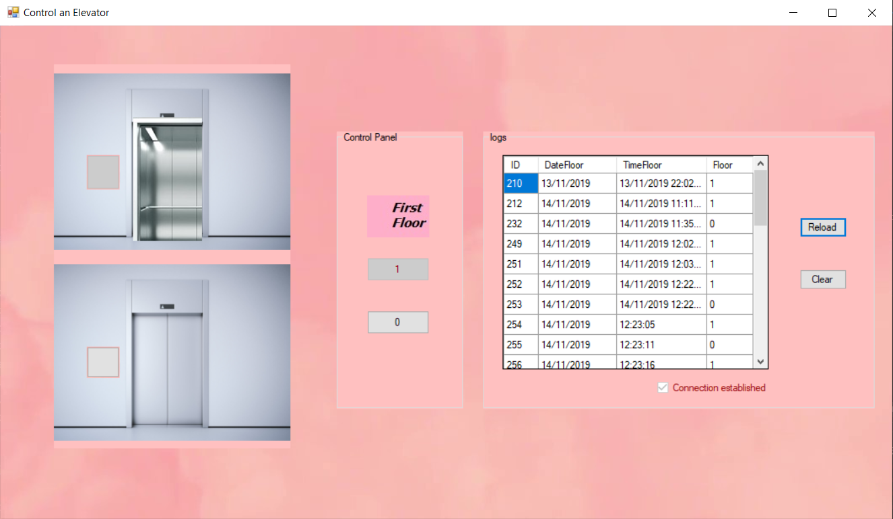

# Elevator-Control-System
## C# .NET Elevator-Control-System

##### This is a elevator control system simulator done for the *OBJECT ORIENTED PROGRAMMING AND SOFTWARE ENGINEERING* unit at UoB.

### Features

* Every move by elevator is registered in the database. Microsoft.ACE.OLEDB.12.0
* The database can be cleaned by clear button.
* The buttons are locked when the lift is moving to avoid inconsistency in the animation. 
* The logs are stored after the program is turned off.

